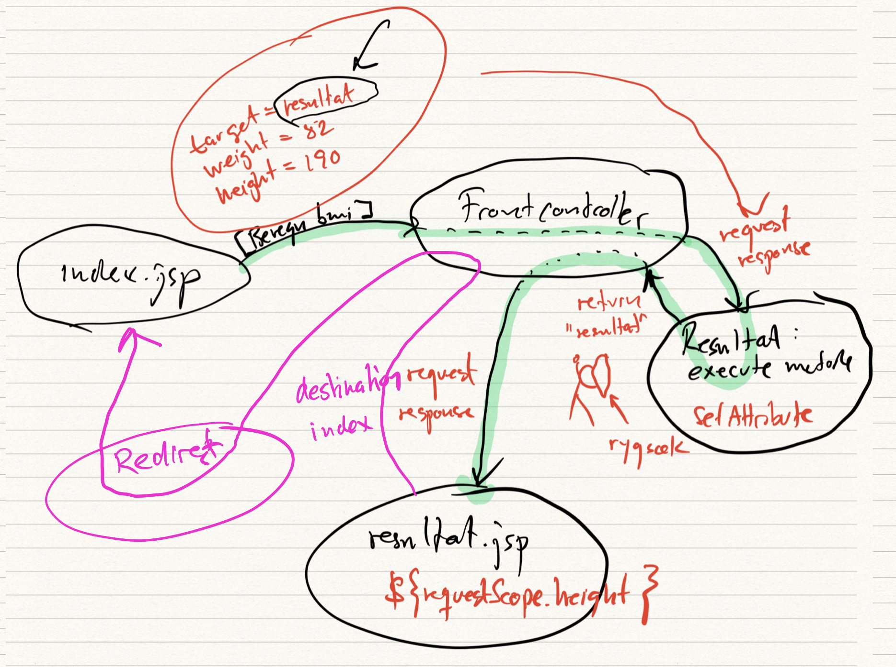

# CphBusiness - Datamatiker uddannelsen
## 2. semester foråret 2020
### Lyngby og Bornholm

Denne side indeholder en samling af videoer, som skal understøtte undervisningen. Indholdet giver først og fremmest mening for de studerende, som har fulgt 1. semester i Lyngby eller på Bornholm, men alle der har interesse er selvfølgelig velkomne til at kigge med.

| Emne   | Titel/video          | Indhold                  |
| :----  | :----------    | :------------------------| 
| Introduktion   | [Introduktion](https://www.youtube.com/watch?v=BfckE05Ue4E) (17:39) | Gennemgang af det faglige indhold på 2. semester |

## Brugergrænseflader

Følgende videoer er lavet til at understøtte undervisning i [brugergrænseflader](https://datsoftlyngby.github.io/dat2sem2020SpringBornholm/Modul1/html/ux_ui.html)

| Emne   | Titel/video          | Indhold                  |
| :----  | :----------    | :------------------------| 
| Introduktion   | [UX & UI for udviklere](https://www.youtube.com/watch?v=suxPabcaALQ) (9:06) | Introduktion til temaet om brugergrænseflader  |
| Prototyper   | [Adobe XD for udviklere](https://youtu.be/BEkzWirRA68) (29:42) | Lav dine egne protyper på baggrund af en use case |

Følgende videoer handler om front-end-udvikling med [HTTP, HTML, CSS og Bootstrap](https://datsoftlyngby.github.io/dat2sem2020SpringBornholm/Modul1/html/)

| Emne   | Titel/video          | Indhold                  |
| :----  | :----------    | :------------------------| 
| HTTP   | [HTTP og brugergrænseflader](https://youtu.be/_HzvzJVqYaI) (14:26) |Kort forklaring af hvad der sker, når du henter en webside via en browser.   |
| HTML   | [HTML og brugergrænseflader](https://youtu.be/49WqDg5kQak) (31:24) | Lær at anvende de hyppigst benyttede html-tags. |
| CSS   | [CSS og brugergrænseflader](https://youtu.be/xpenBxw9bRg) (38:50) | Lære at pimpe din HTML med CSS og styling. |
| Bootstrap   | [Bootstrap og brugergrænseflader](https://youtu.be/c4Rd2u4nXUo)] (57:55) | Lær at lave responsive websites og effektiv styling |

## Linux, MySQL og Tomcat i skyen
Følgende videoer er lavet til at understøtte undervisning i [opsætning af en virtuel Ubuntu Server med MySql og Tomcat](https://datsoftlyngby.github.io/dat2sem2020SpringBornholm/Modul2/Week1-Deployment).

| Emne   | Titel/video          | Indhold                  |
| :----  | :----------    | :------------------------| 
|Intro|[Intro til modulet og materialerne](https://youtu.be/UxokCeT9WZ4) (6:01)| Oversigt over hele installationsprocessen|
|Cloud Computing|[Hvad er Cloud Computing?](https://youtu.be/Go0ETuLyyUc) (23:49)|Alle snakker om skyen, men hvad er det?|
|Virtualisering|[Hvad er en virtuel maskine](https://youtu.be/hUgdtbD0DRQ) (24:14)|Forstå grundprincipperne bag virtualisering|
|Installation af VM|[Opsætning af Linux server og SSH](https://youtu.be/Spw31uwW0S0) (46:21)|Installer en virtuel maskine hos Digital Ocean og forbind til den via SSH|
|FTP|[Installation af Filezilla og forbindelse til Droplet](https://youtu.be/RNlXL4FVAeQ) (7:39)|Lær at overføre filer til din Droplet via sFTP |
|MySql Database|[Installation af MySQL server 8](https://youtu.be/bKwWKw9YC7A) (26:00)|Installer en MySql server på din droplet og forbind til den via Workbench og SSH|
|Tomcat webserver|[Installation af Tomcat 9](https://youtu.be/Iktg2A6S4y8) (32:03)|Installation og konfigurering af en web server / servlet container. Lær også hvordan man kan deploye et html/css website via Tomcats manager|

## Java webstack BMI tutorial

Her er en videoserie, hvor I bliver taget i hånden fra A-Z og koder et lille website, som kan beregne et BMI tal. Nedenstående tegning bruges i videoerne og viser hvordan kommunikationen mellem websiderne via front controlleren fungerer.

| Emne   | Titel/video          | Indhold                  |
| :----  | :----------    | :------------------------| 
|1. Mockup |[Intro til opgave og mockup i Adobe XD](https://youtu.be/yNQ9VWFhaVY) (13:05)|Der laves en mockup i Adobe XD|
|2. HTML og Bootstrap|[Mockup laves i html og bootstrap](https://youtu.be/SFjPAc8AUPQ) (19:07)|Adobe XD mockup'en konverteres til en html udgave, der kan vises i en browser|
|3. Java web projekt |[Opsætning af java web projekt](https://youtu.be/ieFCdggt1Zs) (11:46)|Vi sætter projektet op i IntelliJ|
|4. Includefiler|[Brug af include-filer](https://youtu.be/sra2sZfsVnw) (3:15)|Gør dine jsp-filer mere overskuelige ved hjælp af header og footer include-filer.|
|5. Ny JSP-side|[Resultatsiden tilføjes](https://youtu.be/FhLXchKJ3JE) (22:49)|Vi udvider vores website med en ny jsp-side og tilføjer et nyt command-objekt.|
|6. Beregninger|[Beregninger](https://youtu.be/sdYO350jn54) (13:21)|Vi beregner BMI i execute metoden og fisker de nødvendige parametre ud af requestobjektet|
|7. Refaktorisering|[Refaktorisering](https://youtu.be/Uz7En7T8EgY) (7:20)|Så gøres koden mere test-bar ved at flytte bmi beregninger ud i nogle selvstændige hjælpefunktioner|
|8. Håndtering af links|[Links og Redirection](https://youtu.be/IsG9NVE6j4Q) (13:03)|En ting er at hoppe fra en jsp til en anden via klik på en knap i en formular, en anden ting af at bruge et `<a href="....">` link. Her gives et bud på hvordan vi kan gøre det - og samtidig stryge forbi FrontControlleren|
|9. Opsummering|[Kogebogsopskrift](https://youtu.be/5afd2Z2i0_Y) (7:26)|Projektet afrundes og forenden af regnbuen ligger en opskift på 4 trin, der skal gennemføres hver gang en ny jsp-side skal tilføjes |

#### Bonus videoer, som bygger videre på BMI koden:

| Emne   | Titel/video          | Indhold                  |
| :----  | :----------    | :------------------------| 
|10. Initialisering |[Initialisering af data](https://youtu.be/uCJJLUyV74k) (13:52)|Første gang man rammer index.jsp kan man godt have brug for at befolke sine datastrukturer fra en database etc. Se her hvordan.|

## IDE: IntelliJ (work in progress)
På 1. og 2. semester har vi valgt primært at anvende [IntellJ](https://www.jetbrains.com/idea/) fra firmaet [JetBrains](https://www.jetbrains.com/), som [IDE](https://en.wikipedia.org/wiki/Integrated_development_environment) (Integrated Development Environment). Hvis ikke du allerede har installeret IntelliJ, så kan du erhverve dig en [gratis licens for studerende](https://www.jetbrains.com/student/) her. Bagefter skal du downloade og installere IntelliJ i Ultimate Edition og indtaste den tilsendte licenskode. Hvis du hellere vil anvende Netbeans eller et andet IDE er det også fint, men videoerne på denne side er baseret på IntelliJ.

Følgende videoer er en introduktion til IntelliJ. Det er vigtigt at du har fået installeret Ultimate Edition. 

| Emne   | Titel/video          | Indhold                  |
| :----  | :----------    | :------------------------| 
| Introduktion   | [Hvad er IntelliJ?]() (mm:ss) | Kort introduktion og lidt baggrundsinfo |
| Kom i gang   | [Nyt Java-projekt]() (mm:ss) | Begynd på et nyt Java-projekt (1. semester style) |
| JDBC   | [Brug af JDBC]() (mm:ss) | Få hul igennem til din MySql database |
| Brug af Maven   | [Maven]() (mm:ss) | Få styr på dine dependencies med Maven |
| Webprojekter og Tomcat   | [Webprojekt og Tomcat]() (mm:ss) | Sådan starter du et webprojekt og deployer til Tomcat |
| Unit-test og Debugging  | [Unit-test og debugging]() (mm:ss) | Se hvordan du kan teste og debugge dine programmer |
| Git | [Git og IntelliJ]() (mm:ss) | Anbefalinger til brug af Git sammen med IntelliJ projekter |

